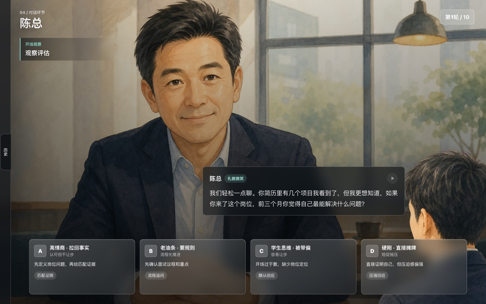
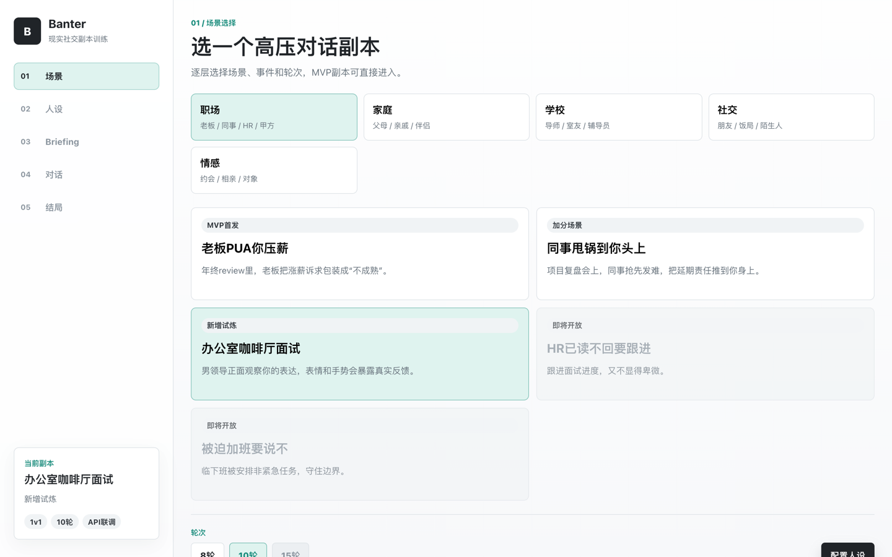
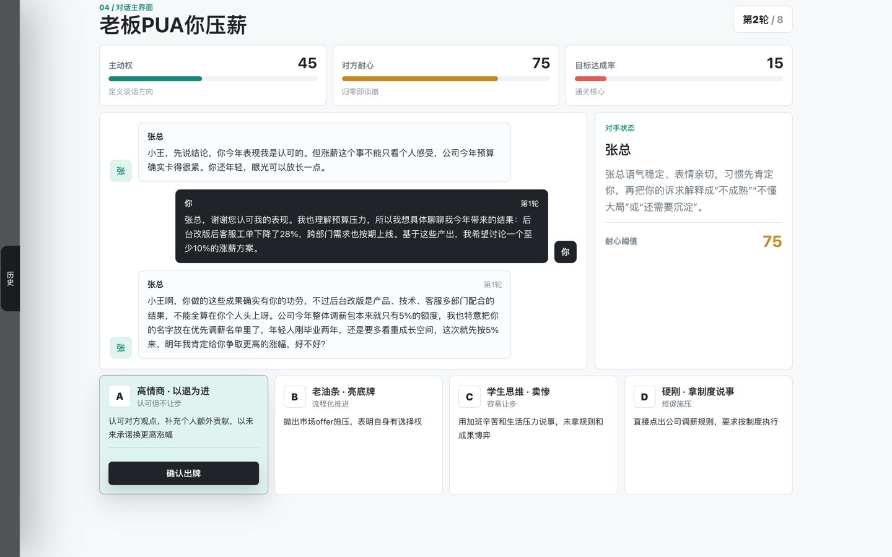
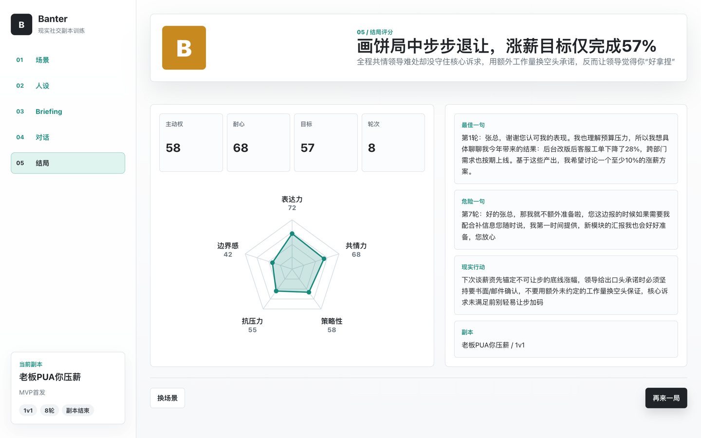

# Banter ·《别把天聊死》

> **剧本杀式 AI 社交训练副本** —— 选场景 · 选对手 · 出牌对话 · 数值博弈 · 通关评分。
> 不是话术生成器，是让你**敢开口、能复盘**的实战沙盘。



---

## 这是什么

很多人不是不会聊天，而是**没有安全的地方练**：面对老板压薪、相亲冷场、朋友借钱这种高压对话，现实里一次试错的成本太高。

Banter 把这些场景做成**可反复重开的副本**：你扮演当事人，AI 扮演对手（老板、面试官、相亲对象、朋友……），你每一轮从 4 张「话术卡」里挑一张出牌，对手即时回应，三个数值实时涨跌，最后给你一份带评级和雷达图的复盘报告。**像打游戏一样练真实社交。**

纯前端 SPA，无后端；AI 对话与结局评分接[阶跃星辰 StepFun](https://platform.stepfun.com/)（OpenAI 兼容）。没有 API key 也能用内置本地数据空跑全流程。

---

## 怎么玩

**选场景 → 配人设 → 出牌对话 → 三数值博弈 → 通关评分**

#### 1. 选一个高压对话副本
按 职场 / 情感 / 社交 分类挑场景，再选 8 或 10 轮。



#### 2. 出牌对话，盯住三个数值
每轮从 4 张不同策略风格的话术卡里出一张，对手即时回应。盯紧顶部三条：

| 数值 | 含义 |
|------|------|
| **主动权** | 谁在定义谈话方向 |
| **对方耐心** | 归零就谈崩 |
| **目标达成率** | 通关核心 |

4 种出牌人格各有得失——**高情商**（利益交换）、**老油条**（走流程/外部施压）、**学生思维**（轻易退让）、**硬刚**（摆事实施压）。



#### 3. 通关评分 + 复盘
结束给出字母评级、一句话总评、五维能力雷达（表达力 / 共情力 / 策略性 / 抗压力 / 边界感），外加**最佳一句**、**危险一句**和**现实行动建议**。



---

## 亮点

- 🎭 **剧本杀式代入**：选角、出牌、数值博弈，把"练社交"变成一局游戏。
- 🃏 **4 种出牌人格**：同一句话，不同策略风格走向完全不同的结局。
- 📊 **三数值实时博弈 + 五维雷达复盘**：不只给答案，给你一份能复盘的报告。
- 🤖 **AI 真实对手**：对手反应、结局评语、评分全部由大模型即时生成（阶跃星辰 `step-3.7-flash`）。
- 🎬 **沉浸式演示场景**：「办公室咖啡厅面试」全屏实景 + 角色 **TTS 语音配音** + 表情反馈状态机。
- 🛡️ **demo / 真实 API 分流 + 容错**：演示场景永远走本地预设（台词与语音逐字匹配）；其余场景走真实 API，失败自动重试，连续失败回退本地规则，**断网也不卡死**。

---

## 6 个可玩场景

| 分类 | 场景 | 说明 |
|------|------|------|
| 职场 | 办公室咖啡厅面试 | **沉浸式演示 demo**：预设台词 + TTS 配音，永远本地 |
| 职场 | 老板 PUA 你压薪 | 年终 review 被画饼压薪 |
| 职场 | 同事甩锅到你头上 | 项目复盘会上的责任甩锅 |
| 情感 | 初次约会冷场 | 把尴尬聊回温度 |
| 情感 | 相亲价值观试探 | 试探型对话里守住边界 |
| 社交 | 朋友开口借钱 | 既不伤感情又不当冤大头 |

---

## 30 秒上手（本地）

```bash
git clone https://github.com/Closed-Book/Banter.git
cd Banter
npm install
cp .env.example .env      # 默认 VITE_USE_MOCK=true，没有 API key 也能空跑全流程
npm run dev               # 打开 http://localhost:5173
```

接真实 AI：把 `.env` 里 `VITE_USE_MOCK` 改为 `false`，填入有效的 `VITE_STEPFUN_API_KEY`（模型默认 `step-3.7-flash`）。届时除「办公室咖啡厅面试」（永远本地）外，其余场景走真实对话 + 真实结局评分。

---

## 技术栈

- **前端**：React 18 + Vite（纯前端 SPA，无后端）
- **AI**：阶跃星辰 StepFun API（OpenAI 兼容，对话默认 `step-3.7-flash`）
- **可视化**：手写 SVG 五维雷达图（无第三方图表库）
- **语音**：demo 场景预生成 TTS（`public/tts/*.mp3`）
- **部署**：本地 dev / Vercel

---

## 给开发者

代码高度集中在单文件，便于通读：

| 想改 / 想查 | 看这里 |
|------------|--------|
| 对话流程 / 场景分流 / 真实 API 调用 / 本地兜底 / 全部场景与卡牌内容 | `src/App.jsx`（自包含主文件） |
| 全局样式 | `src/styles/global.css` |
| demo TTS 语音 | `public/tts/*.mp3` + `src/tts-manifest.json`（文本 ↔ 音轨 ↔ 表情映射，与音频逐字匹配，勿乱动） |
| API key / 模型 / mock 开关 | `.env`（基于 `.env.example`，已 gitignore，不入库） |

场景分流开关在 `src/App.jsx`：`sceneUsesLocal = scene.demo || useMock || !key`。
